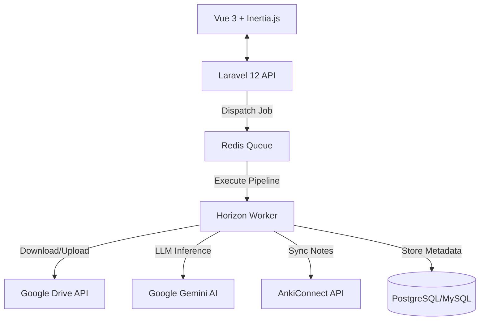
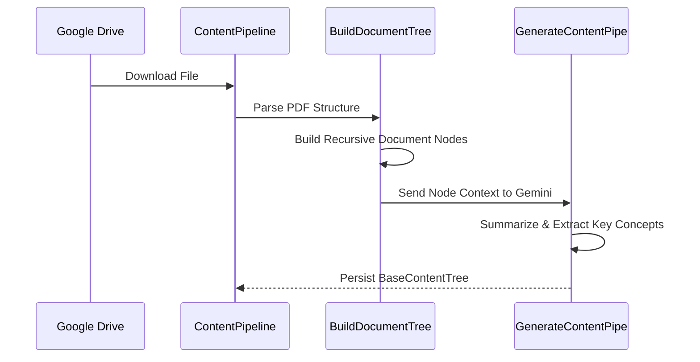
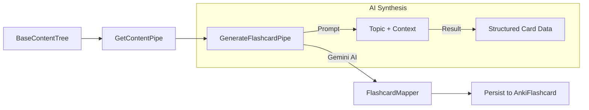
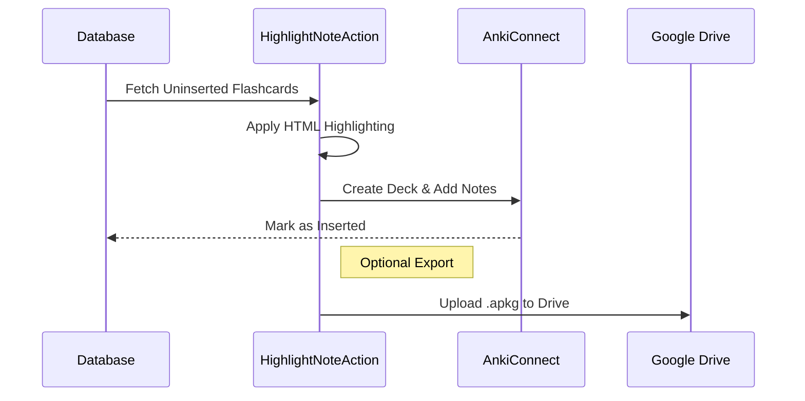

# Flashcard Generation System (Laravel + Gemini + Anki)

A sophisticated, AI-driven engine for transforming complex documents into high-quality flashcards. Built with Laravel 12 and Vue 3, it leverages Google Gemini LLMs to parse content, generate context-aware cards, and export them directly to Anki or Google Drive.

## 🏗 Architecture Overview

The system follows a **Domain-Driven Action** architecture, prioritizing asynchronous processing for heavy AI and file operations.



### Core Components
-   **Laravel API**: Handles authentication (Sanctum), file management, and orchestration.
-   **Gemini Integration**: Utilizing `google-gemini-php/laravel` for intelligent document parsing and flashcard synthesis.
-   **Pipeline Engine**: Sequential stages for document tree building and iterative flashcard generation.
-   **Horizon Workers**: Manage long-running jobs including PDF parsing, AI prompt execution, and cloud synchronization.
-   **Inertia.js Frontend**: A seamless SPA experience built with Vue 3 and Tailwind CSS 4.

## 📂 Project Structure Mapping

The codebase is organized by **domain-specific responsibility**:

```text
app/
├── Actions/
│   ├── Anki/           # AnkiConnect integration, Deck/Note optimization, and APKG exports
│   ├── Gemini/         # Structured JSON generation via LLM
│   └── Google/         # Drive file operations (Download, Upload, Metadata)
├── DTOs/               # Strongly-typed Data Transfer Objects (Parser, Anki, Content)
├── Pipelines/
│   ├── Content/        # Pipeline for transforming raw files into Document Trees
│   └── Flashcard/      # Pipeline for generating cards from Document Nodes
├── Prompts/            # Structured AI instructions and templates for Gemini
├── Services/           # External integrations (Parser, Anki, Google API)
├── Models/             # Eloquent models (AnkiFlashcard, BaseContentTree, GeneratedContent)
├── Support/            # Domain-specific helpers (AnkiFieldNormalizer)
└── Mappers/            # Data transformation logic between layers
```

## 🔄 System Flows

### 1. Content Processing Flow (Pipeline)
Source files (e.g., PDFs from Google Drive) are converted into a hierarchical document tree before AI processing.



### 2. Flashcard Generation Flow
Individual flashcards are generated from document nodes using context-aware prompts.



### 3. Anki Synchronization
Generated cards are batch-processed, enhanced with highlights, and pushed to Anki.



## 🚀 Key Performance & Reliability Features

1.  **AI Orchestration**:
    -   **Prompt Engineering**: Uses specialized Prompt classes to ensure Gemini returns structured, valid JSON for flashcard fields.
    -   **Contextual Awareness**: The system passes parent node context to ensure cards are accurate to the specific section of the source document.
2.  **Resiliency & Scalability**:
    -   **Horizon Queues**: Heavy LLM calls and file parsing are offloaded to background workers with automatic retries.
    -   **Chunked Processing**: Batch operations for Anki (e.g., 50 notes at a time) to prevent API timeouts.
3.  **Modern Frontend**:
    -   **Tailwind CSS 4**: Utilizing the latest CSS-first configuration and high-performance engine.
    -   **Vue 3 Composition API**: Clean, reactive UI for managing generation progress and file selection.
4.  **Developer Experience**:
    -   **Laravel Wayfinder**: Optimized routing and discovery.
    -   **Type Safety**: Rigorous use of PHP 8.2+ type system, DTOs, and Enums.

## 🛠 Usage & Extension

### Environment Setup
1.  **Configure Services**: Add your keys to `.env`:
    ```env
    GEMINI_API_KEY=your_key
    GOOGLE_DRIVE_CLIENT_ID=your_id
    ANKI_CONNECT_URL=http://localhost:8765
    ```
2.  **Run Workers**: Start Horizon to process pipelines:
    ```bash
    php artisan horizon
    ```

### Adding New Card Types
1.  **Update Enum**: Add the new type to `app/Enums/CardType.php`.
2.  **Extend Prompts**: Update `app/Prompts/FlashcardGeneratePrompt.php` to handle the new format logic.
3.  **Map Payload**: Update the `buildPayload` method in `app/Actions/Anki/AddFromDatabaseToAnkiAction.php`.
